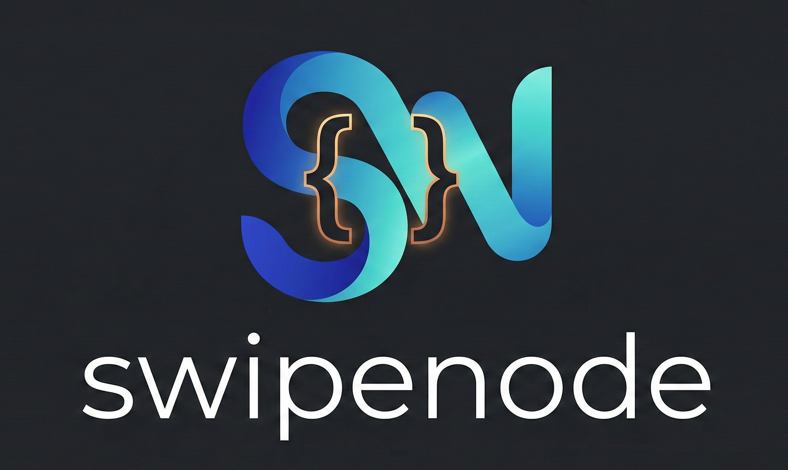

<p align="center">
  
  
  
  
</p>

<p align="center">
  
</p>

<p align="center">
  <strong>Lightning-fast, zero-render web extraction built for AI agents.</strong><br/>
  One binary. One HTTP request. Structured data out — no browser required.
</p>

<p align="center">
  <code>swipenode extract --url https://example.com | jq .</code>
</p>

---

## The Problem

AI agents need web data. The current options are all bad:

| Approach | What goes wrong |
|---|---|
| **Headless browsers** (Playwright, Puppeteer) | 200 MB+ runtime, multi-second startup, breaks in containers, expensive at scale, blocked by WAFs |
| **Raw HTML to the LLM** | Dumps `<div>`, `<script>`, CSS noise — wastes 90%+ of your input tokens on boilerplate |
| **Generic scrapers** (BeautifulSoup, cheerio) | Blind to framework data structures, requires per-site glue code |

Meanwhile, modern frameworks like **Next.js** and **Nuxt.js** embed their entire data layer as structured JSON right in the HTML source — hidden in `<script>` tags, waiting to be read. No JavaScript execution needed.

**SwipeNode extracts it in milliseconds while bypassing modern WAFs.**

## The Solution

SwipeNode is a single static binary that fetches raw HTML, automatically bypasses Cloudflare/Datadome via TLS fingerprint spoofing, and extracts **all structured data** in a single pass. 

```text
┌──────────────┐         ┌─────────────────────────────────────────────┐         ┌──────────────┐
│              │  HTTP   │        Structured Data Extraction           │  JSON   │              │
│   AI Agent   │  GET    │  1. Next.js   ──  __NEXT_DATA__ JSON        │  ────►  │    stdout    │
│              │  ────►  │  2. JSON-LD   ──  application/ld+json       │         │              │
└──────────────┘         │  3. Nuxt.js   ──  window.__NUXT__           │         └──────────────┘
                         │  4. Gatsby    ──  window.___gatsby          │
                         │  5. Remix     ──  window.__remixContext     │
                         └─────────────────────────────────────────────┘
```

- **Smart JSON Pruning:** The extracted payload is automatically put on a "token diet." SwipeNode strips out tracking pixels, telemetry (`_sentryBaggage`), base64 images, and UI noise before returning the JSON.
- **Clean Text Fallback:** If no modern framework is detected, SwipeNode falls back to stripping boilerplate HTML and returning the clean, visible text.

The result: **up to 98% fewer input tokens** compared to sending raw HTML to your LLM.

## Installation

```bash
# Requires Go 1.24+
git clone [https://github.com/sirToby99/swipenode.git](https://github.com/sirToby99/swipenode.git)
cd swipenode
go build -o swipenode .
```

One binary, zero runtime dependencies. Copy it anywhere.

## 🤖 Model Context Protocol (MCP) — For AI Agents

SwipeNode isn't just a CLI tool; it's a native tool for local AI agents like **Claude Desktop**. By running SwipeNode as an MCP server, your AI gets real-time, WAF-bypassing access to the internet.

### One-Click Install for Claude Desktop

```bash
./swipenode install-mcp
```
*This command automatically locates your Claude Desktop configuration and safely registers SwipeNode as an MCP server.*

**How to use it:**
1. Restart Claude Desktop.
2. You'll see the "plug" icon 🔌 indicating tools are available.
3. Ask Claude: *"Use your extract tool to read https://www.theverge.com and summarize the top 3 tech news."*
4. Claude will secretly use SwipeNode to bypass Cloudflare, extract the clean JSON, and give you the perfect summary while saving thousands of API tokens.

## ⚡ Batch Mode (High-Performance Extraction)

Need to process 100 or 1,000 URLs? SwipeNode leverages Go's Goroutines to extract data concurrently without eating up your RAM like Headless Chrome would.

```bash
# Create a list of URLs
cat <<EOF > urls.txt
[https://www.theverge.com/](https://www.theverge.com/)
[https://news.ycombinator.com/](https://news.ycombinator.com/)
EOF

# Run concurrent batch extraction (default: 10 workers)
swipenode batch --file urls.txt --concurrency 5 --out results.json
```
Failed URLs won't crash the process; network and DNS errors are neatly caught and logged per-URL in the resulting JSON array.

## CLI Usage (Single Extraction)

```bash
# Auto-detect framework and extract the best data
swipenode extract --url "[https://example.com/page](https://example.com/page)"

# Explicitly bypass WAFs by impersonating Safari
swipenode extract --url "[https://protected-site.com](https://protected-site.com)" --impersonate safari

# Next.js site — pipe structured JSON straight to jq
swipenode extract --url "[https://nextjs-site.com](https://nextjs-site.com)" | jq '.nextjs.props.pageProps'

# Silence errors, capture just the data
DATA=$(swipenode extract --url "$URL" 2>/dev/null)
```

### CLI Reference

```text
swipenode
├── extract              Extract structured data from a single URL
├── batch                Extract data from multiple URLs concurrently
├── mcp                  Start the stdio Model Context Protocol server
├── install-mcp          Auto-configure SwipeNode for Claude Desktop
└── help                 Help about any command
```

## v1.1 — TLS Fingerprint Spoofing (`--impersonate`)

Many high-security sites (Cloudflare, Datadome, PerimeterX) block requests not just on IP or User-Agent, but on the **TLS handshake fingerprint** — the exact cipher suites, extensions, and ordering that a real browser sends during the SSL/TLS negotiation. Go's standard `net/http` client is trivially detected and blocked.

SwipeNode v1.1 replaces the default HTTP client with **[bogdanfinn/tls-client](https://github.com/bogdanfinn/tls-client)**, producing bit-for-bit accurate TLS hello messages for real browsers. Without this, bot-detection systems see a Go TLS fingerprint and immediately return a 403. With `--impersonate`, the entire TLS negotiation is indistinguishable from a real browser.

### Supported profiles

| Value | Profile |
|---|---|
| `chrome` (default) | Chrome 120 — Windows 10 |
| `safari` | Safari 16.0 — iOS |
| `firefox` | Firefox 120 |

## Python / LLM Integration

SwipeNode is designed to slot into any agent pipeline. Here's the minimal pattern:

```python
import subprocess, json

result = subprocess.run(
    ["./swipenode", "extract", "--url", "[https://example.com](https://example.com)"],
    capture_output=True, text=True,
)
page_data = result.stdout  # clean text or structured JSON — ready for your LLM
```

For a complete working example that pipes extracted data into an OpenAI chat completion, see [`examples/agent_demo.py`](examples/agent_demo.py).

## Architecture

```text
swipenode/
├── main.go                     # Entry point
├── cmd/
│   └── swipenode/
│       ├── root.go             # Cobra root command
│       ├── extract.go          # Single URL extraction
│       ├── batch.go            # Concurrent worker pool extraction
│       ├── mcp.go              # Stdio MCP server
│       └── install_mcp.go      # Auto-installer for Claude Desktop
├── pkg/
│   └── extractor/
│       └── extractor.go        # Structured data extraction & pruning engine
└── examples/
    └── agent_demo.py           # Python + OpenAI agent demo
```

**Design principles:**
1. **Stdout is sacred** — Only clean, parseable data hits stdout. Errors and diagnostics go to stderr. This makes SwipeNode a first-class citizen in shell pipelines and agent tool chains.
2. **Library-first** — `pkg/extractor` is a pure Go library with no CLI dependencies. Import it directly: `extractor.ExtractData(url, impersonate)`.

## Roadmap

- [x] **Next.js** `__NEXT_DATA__` extraction
- [x] **Nuxt.js** `window.__NUXT__` extraction
- [x] **Remix** `window.__remixContext` extraction
- [x] **Gatsby** `window.___gatsby` / `pageData` extraction
- [x] **JSON-LD** `<script type="application/ld+json">` extraction
- [x] **Clean text fallback** — boilerplate-stripped visible text for older sites
- [x] **JSON Pruning** — smart token-diet that strips tracking, analytics, base64, and telemetry noise
- [x] **Advanced TLS-Fingerprint Spoofing** — Bypass strict WAFs (Cloudflare/Datadome)
- [x] **Batch mode** — extract from a list of URLs in parallel
- [x] **MCP server** — expose extractors as Model Context Protocol tools for AI agents
- [x] **WASM build** — *Note: Running SwipeNode natively in the browser via WebAssembly is not currently supported. Browser security models prevent the custom TCP socket dialing required for TLS fingerprint spoofing, meaning a WASM build would fail to bypass WAFs.*

## Contributing

Contributions are welcome. The codebase is intentionally small and approachable.

```bash
git clone [https://github.com/sirToby99/swipenode.git](https://github.com/sirToby99/swipenode.git)
cd swipenode
go build -o swipenode .
go test ./...
```

## Credits

SwipeNode builds on the following open-source libraries:

### bogdanfinn/tls-client

TLS fingerprint spoofing is powered by [bogdanfinn/tls-client](https://github.com/bogdanfinn/tls-client), which is licensed under the **BSD 4-Clause License**:

```text
Copyright (c) 2023, Bogdan Finn
All rights reserved.

Redistribution and use in source and binary forms, with or without
modification, are permitted provided that the following conditions are met:

1. Redistributions of source code must retain the above copyright notice, this
   list of conditions and the following disclaimer.

2. Redistributions in binary form must reproduce the above copyright notice,
   this list of conditions and the following disclaimer in the documentation
   and/or other materials provided with the distribution.

3. All advertising materials mentioning features or use of this software must
   display the following acknowledgement:
   This product includes software developed by Bogdan Finn.

4. Neither the name of the copyright holder nor the names of its contributors
   may be used to endorse or promote products derived from this software
   without specific prior written permission.

THIS SOFTWARE IS PROVIDED BY THE COPYRIGHT HOLDERS AND CONTRIBUTORS "AS IS"
AND ANY EXPRESS OR IMPLIED WARRANTIES, INCLUDING, BUT NOT LIMITED TO, THE
IMPLIED WARRANTIES OF MERCHANTABILITY AND FITNESS FOR A PARTICULAR PURPOSE ARE
DISCLAIMED. IN NO EVENT SHALL THE COPYRIGHT HOLDER OR CONTRIBUTORS BE LIABLE
FOR ANY DIRECT, INDIRECT, INCIDENTAL, SPECIAL, EXEMPLARY, OR CONSEQUENTIAL
DAMAGES (INCLUDING, BUT NOT LIMITED TO, PROCUREMENT OF SUBSTITUTE GOODS OR
SERVICES; LOSS OF USE, DATA, OR PROFITS; OR BUSINESS INTERRUPTION) HOWEVER
CAUSED AND ON ANY THEORY OF LIABILITY, WHETHER IN CONTRACT, STRICT LIABILITY,
OR TORT (INCLUDING NEGLIGENCE OR OTHERWISE) ARISING IN ANY WAY OUT OF THE USE
OF THIS SOFTWARE, EVEN IF ADVISED OF THE POSSIBILITY OF SUCH DAMAGE.
```

## License

```text
Copyright 2026 SwipeNode Contributors

Licensed under the Apache License, Version 2.0 (the "License");
you may not use this file except in compliance with the License.
You may obtain a copy of the License at

    [http://www.apache.org/licenses/LICENSE-2.0](http://www.apache.org/licenses/LICENSE-2.0)

Unless required by applicable law or agreed to in writing, software
distributed under the License is distributed on an "AS IS" BASIS,
WITHOUT WARRANTIES OR CONDITIONS OF ANY KIND, either express or implied.
See the License for the specific language governing permissions and
limitations under the License.
```

---

<p align="center">
  <sub>Built for the age of AI agents. No browsers were harmed in the making of this tool.</sub>
</p>
